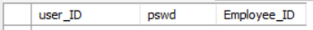
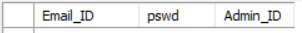

# **Employee Management System**

### **Introduction**
<pre>
This is a management system application which using mysql database as backend to store user data.
</pre>

### **Sections:**
<pre>
<b>Admin</b> 
It allows the individual to provide privilege to Add, Remove and Update data of the User section individuals.

<b>User</b> 
It allows the user individuals to view the employee details using its <b>USER ID</b> and also allows the user to update their own user password.
</pre>

### **Data Tables:**
<pre>Data tables are tables used in our database to create and design the workflow of our management system application.

<b>employee</b>
This table contains the following attributes:
</pre>

<pre><b>job_dept</b>
Following attributes are present in "job_dept" table:</pre>

<pre><b>credentials</b>
Following attributes are present in "credentials" table:</pre>

<pre><b>user</b>
Following attributes are present in "user" table:</pre>

<pre><b>salary</b>
Following attributes are present in "salary" table:</pre>

<pre><b>projects</b>
Following attributes are present in "projects" table:</pre>

<pre><b>emp_leaves</b>
Following attributes are present in "emp_leaves" table:</pre>

<pre><b>admin_credentials</b>
Following attributes are present in "admin_credentials" table:</pre>

<pre>
<b>NOTE:
Employee_ID always begins with "E-"
Admin_ID always begins with "Ad-"</b>
</pre>

## Procedure to Install and Run the entire Project

- **Step-1:** Download the entire project from github repository.
- **Step-2:** Create a Python virtual environment for the entire project at local machine. **(Recommended)**
- **Step-3:** Execute command to install all the dependancies of the project:
-             pip install -r requirements.txt
- **Step-4:** Execute the command to run the web app:
-             streamlit run app.py
